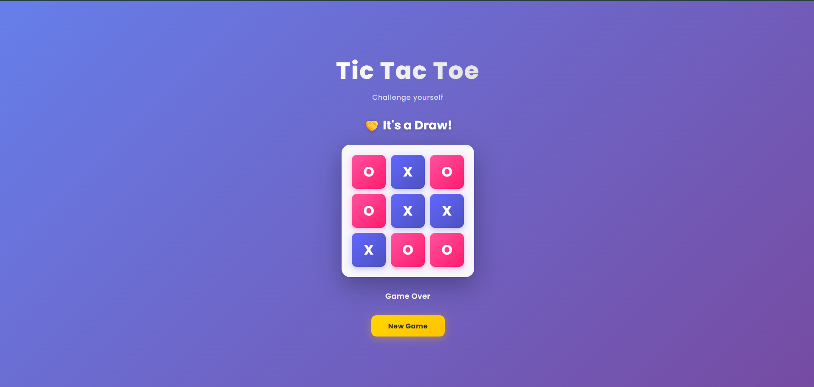
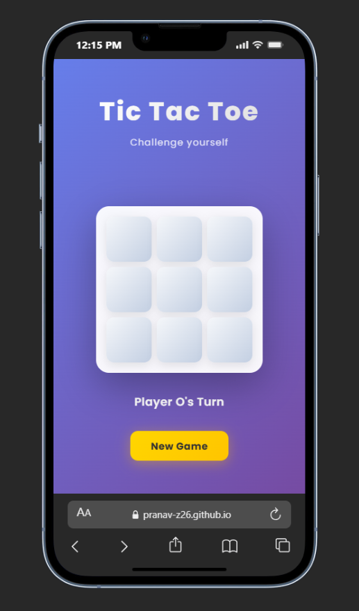

# 🎮 Tic Tac Toe - Modern UI Edition

> **A Fun Weekend Project** - One evening, I felt like going back to basics and decided to build something fun with vanilla JavaScript. It's been quite a while since I played around with pure JS (no frameworks), so I decided to revisit the classics and give it a modern twist. The result? A beautifully designed, fully responsive Tic Tac Toe game with smooth animations! 
>
> *- Built by Pranav Zagade*

A beautifully designed, fully responsive Tic Tac Toe game with smooth animations and a modern user interface. Play against a friend in this classic game with a contemporary twist!

## 📸 Screenshots

### Desktop View

*Beautiful gradient background with clean, interactive game board*

### Mobile View

*Fully responsive design that works seamlessly on mobile devices*

## ✨ Features

- **Modern UI Design** - Sleek gradient background with glassmorphism effects
- **Smooth Animations** - Elegant transitions and micro-interactions
- **Color-Coded Players**
  - 🎀 Player O: Pink gradient (#FF52A0)
  - 🔵 Player X: Blue gradient (#6367FF)
- **Real-time Status** - Live player turn indicator
- **Responsive Design** - Works perfectly on desktop, tablet, and mobile devices
- **Visual Feedback** - Hover effects, click animations, and winning cell highlighting
- **Draw Detection** - Automatically detects draw games
- **Easy Reset** - Quick "New Game" button to start over
- **Winning Animations** - Celebratory pulse animation on winning cells

## 🎯 How to Play

1. **Open** `index.html` in your web browser
2. **Player O goes first** - Click any empty cell to place your mark
3. **Player X goes next** - Take turns marking cells
4. **Win the Game** - Get three marks in a row (horizontally, vertically, or diagonally)
5. **Draw Game** - If all cells are filled with no winner, it's a draw
6. **Play Again** - Click "New Game" to reset and play another round

## 🏗️ Project Structure

```
tic-tac-toe/
├── index.html       # HTML structure and markup
├── styles.css       # Modern styling and animations
├── script.js        # Game logic and interactivity
└── README.md        # Documentation (this file)
```

## 🛠️ Technologies Used

- **HTML5** - Semantic markup structure
- **CSS3** - Modern styling with:
  - CSS Grid for the game board
  - Gradient backgrounds and colors
  - Smooth animations and transitions
  - Flexbox for responsive layout
- **Vanilla JavaScript** - Pure JS (no frameworks) for game logic
- **Google Fonts** - Poppins font family for modern typography

## 📋 Winning Combinations

The game checks for wins across:
- **Rows** - Top, middle, bottom
- **Columns** - Left, center, right
- **Diagonals** - Both diagonal directions

```
[0] [1] [2]
[3] [4] [5]
[6] [7] [8]
```

Winning combinations:
- Rows: [0,1,2], [3,4,5], [6,7,8]
- Columns: [0,3,6], [1,4,7], [2,5,8]
- Diagonals: [0,4,8], [2,4,6]

## 🎨 Design Highlights

### Color Palette
- **Primary Background**: Purple Gradient (#667eea → #764ba2)
- **Game Board**: Clean White with transparency
- **Player O**: Pink Gradient (#FF52A0 → #FF1B6D)
- **Player X**: Blue Gradient (#6367FF → #4C51BF)
- **Action Button**: Golden Yellow (#FFD600 → #FFC400)

### Typography
- **Font Family**: Poppins (Google Fonts)
- **Title**: 3.5rem, bold with gradient text effect
- **Subtitle**: 1rem, light with transparency
- **Status**: 1.1rem, clean and readable

### Animations
- **Slide Down** - Header entrance animation
- **Pop In** - Game board appearance
- **Fade In** - Winner text display
- **Pulse** - Winning cells celebration
- **Hover Effects** - Smooth lift and scale on buttons

## 📱 Responsive Breakpoints

The game is optimized for all screen sizes:
- **Desktop** (1200px+) - Full-size experience
- **Tablet** (768px - 1199px) - Adjusted spacing
- **Mobile** (< 768px) - Optimized for touch with smaller board

## 🚀 Quick Start

1. Clone or download the project
2. Navigate to the `tic-tac-toe` folder
3. Open `index.html` in your browser
4. Start playing!

```bash
# No installation or dependencies needed!
# Just open index.html in your browser
```

## 💡 Game Features Explained

### Turn Indicator
See whose turn it is at all times with the live status display below the game board.

### Visual Player Distinction
Each player has a unique color:
- O appears in **pink**
- X appears in **blue**

This makes it easy to quickly scan and identify game state.

### Winning Celebration
When a player wins:
- Winning cells pulse with animation
- Victory message displays with celebration emoji
- All remaining buttons are disabled
- "New Game" button becomes active

### Draw Detection
If all 9 cells are filled with no winner, the game declares it a draw with a friendly message.

## 🔧 JavaScript Logic

The game includes:
- **Event listeners** for button clicks
- **Winner checking algorithm** that validates all 8 winning combinations
- **Game state management** for tracking turns and game status
- **DOM manipulation** for dynamic UI updates
- **Reset functionality** to clear the board and start fresh

## 📈 Future Enhancements

Possible improvements for future versions:
- AI opponent (single player mode)
- Score tracking
- Game history/statistics
- Sound effects
- Difficulty levels
- Dark mode toggle
- Multiplayer online support

## 👨‍💻 Code Quality

- Clean, readable code with meaningful variable names
- Modular functions for maintainability
- No external dependencies required
- CSS Grid for elegant layout
- Semantic HTML structure
- Mobile-first responsive design

## 📝 License

This project is open source and available for personal and educational use.

## 🎉 Enjoy Playing!

Have fun with this modern take on the classic Tic Tac Toe game! Challenge your friends and see who's the ultimate strategist.

---
**See my other cool deployed projects on - "pranavzagade.in"**
**Made with ❤️ and fun by - Pranav Zagade**
